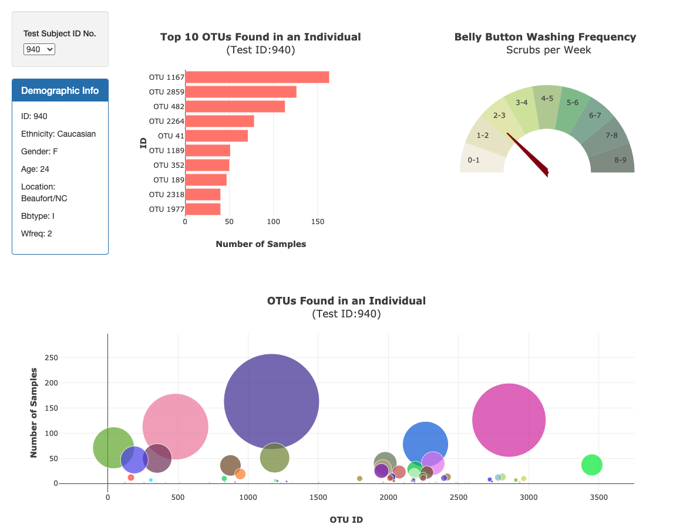
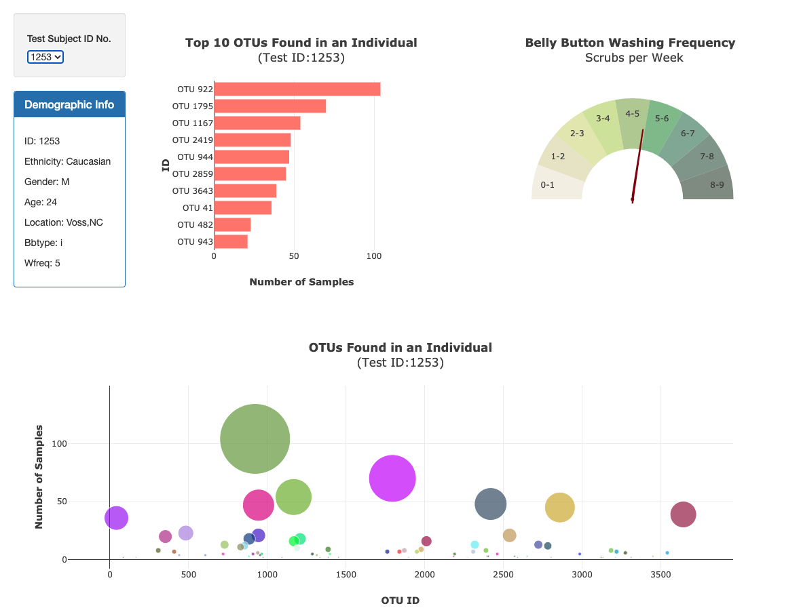
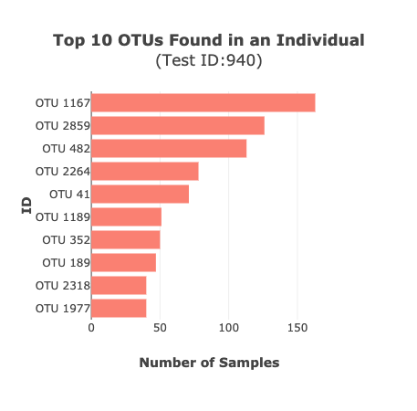
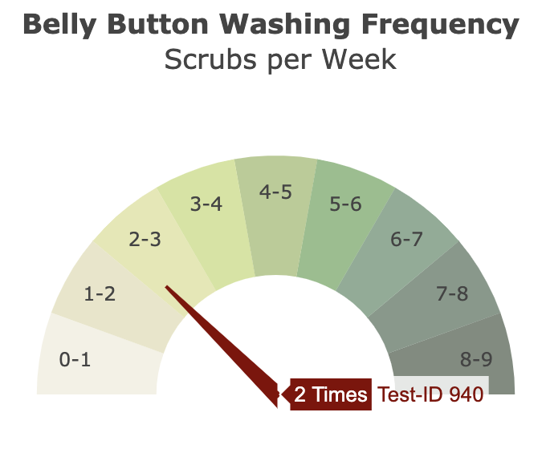
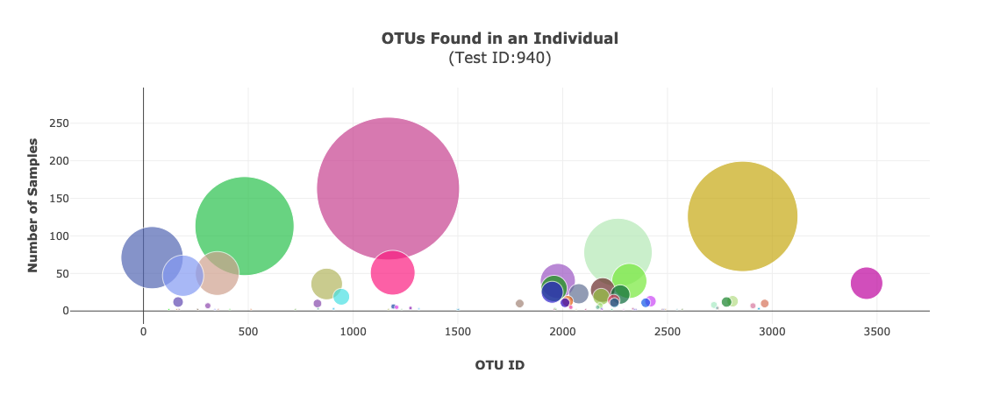

# Belly Button Biodiversity

Visit Belly Button Biodiversity Website >> [Click Here!](https://abpuccini.github.io/plotly-challenge/)

## Background

To construct an interactive dashboard to explore the Belly Button Biodiversity dataset, which catalogs the microbes that colonize human navels.

Dataset: [Belly Button Biodiversity Dataset](data/samples.json)

Source: [NC State The Public Science Lab](http://robdunnlab.com/projects/belly-button-biodiversity/)

Script: [Javascript Code](static/js/app.js)

## Dashboard Blueprint

### Selection and Data Retriever

- Data and visualization will be rendered based on test ID no. 940 when users visit the webpage

    

- Users will select **`Test Subject ID No.`** in order to render all visualizations based on the selected ID to the webpage.

    

### Bar Chart

The visualization reveals the top 10 operational taxonomic units (OTUs) in an individual test subject.

    

### Gauge Chart

The visualization reveals the washing frequency per week for an individual test subject.

    

### Bubble Chart

The visualization reveals the all operational taxonomic units (OTUs) in an individual test subject.

    

### Research Context

Overview of Belly Botton Biodiversity and what the research team found during the study.

## References

> Dumke, K. (2013, May 15). Belly Button Biodiversity. Retrieved December 17, 2020, from https://www.nationalgeographic.org/article/belly-button-biodiversity/

> Experts, K. (Ed.). (n.d.). Why Do I Have a Belly Button? (for Kids) - Nemours KidsHealth. Retrieved December 17, 2020, from https://kidshealth.org/en/kids/navel.html

> Shipman, M. (2012, November 07). Navel-Gazing Researchers ID Which Species Live in Our Belly Buttons (But Don't Know Why). Retrieved December 17, 2020, from https://news.ncsu.edu/2012/11/wms-belly-button-biodiversity/

---
© [Atcharaporn B Puccini](https://www.linkedin.com/in/abpuccini)